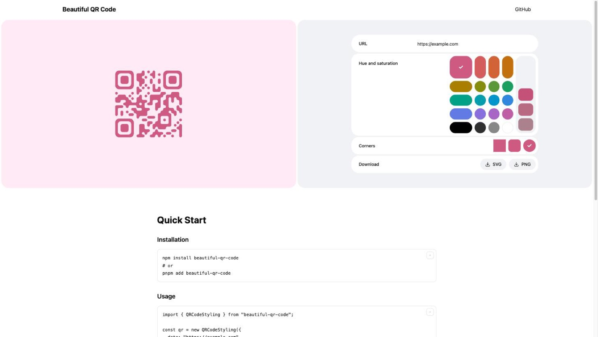

<div align="center">

# [Beautiful QR Code](https://blode.co/beautiful-qr-code)

**Generate QR codes with rounded modules, custom colors, and a centred logo, as SVG or PNG**

Build the code in the browser, render it into any element, and let the user download it.

<p align="center">
  <a href="https://www.npmjs.com/package/beautiful-qr-code">
    
  </a>
  <a href="https://github.com/mblode/beautiful-qr-code/blob/main/LICENSE.md">
    
  </a>
</p>

</div>

<p align="center">
  
</p>

## Demo

Design a code in the browser and download it.

<p>
<a href="https://blode.co/beautiful-qr-code">

</a>
</p>

## Install

```bash
npm install beautiful-qr-code
```

## Quickstart

```html
<div id="qr-container"></div>
```

```ts
import { QRCodeStyling } from "beautiful-qr-code";

const qrCode = new QRCodeStyling({
  data: "https://blode.co",
  foregroundColor: "#1a73e8",
  backgroundColor: "#ffffff",
  radius: 1,
});

await qrCode.append(document.getElementById("qr-container"));
await qrCode.download({ name: "blode", extension: "png" });
```

Call `update()` to change any option in place, or `getSVG()` and `getCanvas()` to take the output without rendering it.

## React

```bash
npm install @beautiful-qr-code/react
```

```tsx
import { BeautifulQRCode } from "@beautiful-qr-code/react";

export function Share() {
  return (
    <BeautifulQRCode
      backgroundColor="#ffffff"
      data="https://blode.co"
      foregroundColor="#1a73e8"
      radius={1}
    />
  );
}
```

## CLI

```bash
npx @beautiful-qr-code/cli "https://blode.co" -o blode.png
```

The format is inferred from the output extension, so that writes a PNG.

| Flag | Default | Description |
|------|---------|-------------|
| `-o, --output <path>` | `qr-code.svg` | Where to write the file |
| `-f, --format <type>` | inferred | `svg` or `png` |
| `--color <hex>` | `#000000` | Module color |
| `--bg <hex>` | `transparent` | Background color |
| `--radius <number>` | `1` | Module corner radius, 0 to 1 |
| `--padding <number>` | `1` | Quiet zone in modules |
| `--logo <path>` | | Logo image URL or local path |

## Notes

- Set `logoUrl` and error correction rises to level H automatically, so the code still scans with its centre covered.
- Set `type: "canvas"` for a canvas element instead of inline SVG.
- The CLI installs as both `beautiful-qr-code` and the shorthand `bqr`.

## License

MIT

---

Crafted by [](https://blode.co) [Matthew Blode](https://blode.co)
